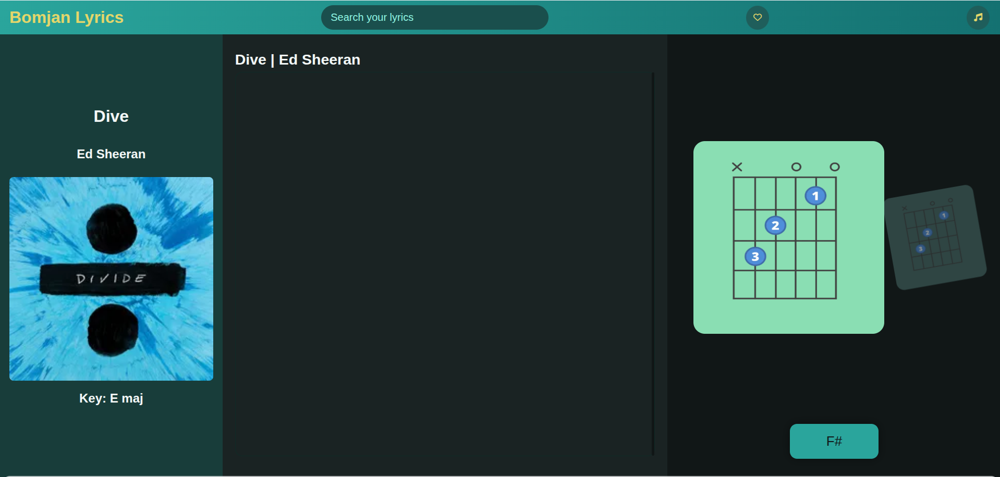

# Bomjan Lyrics

A professional, feature-rich lyrics and chord viewer designed specifically for guitarists and singers. View synchronized lyrics with chord diagrams, search through your song library, save favorites, and enjoy a beautiful, responsive interface.



## Features

### Core Functionality
- **Synchronized Lyrics Display** - View lyrics with real-time highlighting
- **Interactive Chord Diagrams** - Visual guitar chord representations
- **Auto-Scroll** - Automatic lyric scrolling with adjustable speed
- **Chord Indicators** - See which chord plays with each lyric line

### Song Management
- **Powerful Search** - Search by song title, artist, or tags
- **Song Library** - Beautiful modal with all your songs
- **Favorites System** - Save your favorite songs with one click
- **Persistent Storage** - Your preferences and favorites are saved locally

### Keyboard Shortcuts
- `Space` - Play/Pause auto-scroll
- `↑` - Previous lyric line
- `↓` - Next lyric line
- `L` - Open song library
- `F` - Toggle favorite for current song

### Modern UI/UX
- **Glassmorphism Design** - Modern, sleek interface with backdrop blur
- **Smooth Animations** - Polished transitions and micro-interactions
- **Responsive Layout** - Works perfectly on desktop, tablet, and mobile
- **Dark Theme** - Easy on the eyes for long practice sessions

## Project Structure

```
Bomjan-Lyrics/
├── index.html              # Main application page
├── README.md               # Project documentation
├── css/
│   └── style.css          # All styles with responsive design
├── js/
│   ├── script.js          # Main application logic
│   └── utils.js           # Utility functions (storage, chords, etc.)
├── data/
│   └── songs.json         # Song database with lyrics and chords
├── images/
│   ├── screenshot.png     # Project screenshot
│   ├── dive.webp          # Album artwork
│   └── c-chord.webp       # Chord diagrams
└── examples/
    └── advanced-player.html  # Advanced player example
```

## Getting Started

### Prerequisites
- A modern web browser (Chrome, Firefox, Safari, or Edge)
- A local web server (optional, but recommended)

### Installation

1. **Clone or download this repository**
   ```bash
   git clone https://github.com/yourusername/bomjan-lyrics.git
   cd bomjan-lyrics
   ```

2. **Serve the files**
   
   **Option A: Using Python**
   ```bash
   # Python 3
   python -m http.server 8000
   
   # Python 2
   python -m SimpleHTTPServer 8000
   ```
   
   **Option B: Using Node.js**
   ```bash
   npx serve
   ```
   
   **Option C: Using VS Code**
   - Install the "Live Server" extension
   - Right-click on `index.html` and select "Open with Live Server"

3. **Open in browser**
   - Navigate to `http://localhost:8000` (or the port shown by your server)

##  Usage Guide

### Viewing Lyrics
1. The app loads with a default song
2. Click on any lyric line to jump to that position
3. Use the arrow keys to navigate line by line
4. Press `Space` to start/stop auto-scroll

### Searching for Songs
1. Type in the search bar at the top
2. Search works across song titles, artists, and tags
3. Results appear in real-time

### Managing Your Library
1. Click the music icon (🎵) or press `L` to open the library
2. Browse all available songs in a beautiful grid
3. Click any song card to load it
4. Songs marked with ❤️ are in your favorites

### Saving Favorites
1. Click the heart icon (♥) in the header
2. Or press `F` on your keyboard
3. Favorites are saved automatically
4. View all favorites in the library (marked with ❤️)

### Adding New Songs
1. Open `data/songs.json`
2. Add your song following this structure:
   ```json
   {
     "id": "unique-song-id",
     "title": "Song Title",
     "artist": "Artist Name",
     "key": "C maj",
     "tempo": 120,
     "image": "images/cover.webp",
     "tags": ["genre", "mood"],
     "lyrics": [
       { "line": "First line", "chord": "C", "time": 0 },
       { "line": "Second line", "chord": "G", "time": 4 }
     ],
     "chords": [
       { "name": "C", "guitar": [0, 3, 2, 0, 1, 0], "piano": ["C", "E", "G"] }
     ]
   }
   ```

## Chord Format

### Guitar Chords
Guitar chords are represented as an array of 6 numbers (one for each string, from low E to high E):
- `0` = Open string
- `1-20` = Fret number
- `-1` or `x` = Muted string

Example: `[0, 3, 2, 0, 1, 0]` = C major chord

### Piano Chords
Piano chords are represented as an array of note names:
Example: `["C", "E", "G"]` = C major triad

## 🛠️ Customization

### Changing Colors
Edit `css/style.css` and modify these CSS variables:
```css
/* Main colors */
--primary: #2aa59c;
--secondary: #147171;
--accent: #e4d66a;
--background: #111717;
```

### Adjusting Auto-Scroll Speed
In `js/script.js`, modify the `settings` object:
```javascript
this.settings = storage.get('settings', {
  autoScroll: false,
  scrollSpeed: 1,  // Change this value (0.5 = slower, 2 = faster)
  fontSize: 19,
  instrument: 'guitar'
});
```

## Browser Compatibility

- Chrome/Edge 90+
- Firefox 88+
- Safari 14+
- Opera 76+

## Mobile Support

The app is fully responsive and works great on:
-  Smartphones (320px and up)
-  Tablets (768px and up)
-  Desktops (1024px and up)

## Contributing

Contributions are welcome! Here's how you can help:

1. Fork the repository
2. Create a feature branch (`git checkout -b feature/AmazingFeature`)
3. Commit your changes (`git commit -m 'Add some AmazingFeature'`)
4. Push to the branch (`git push origin feature/AmazingFeature`)
5. Open a Pull Request

## License

This project is open source and available under the [MIT License](LICENSE).

## Acknowledgments

- Font Awesome for the beautiful icons
- Google Fonts for the Inter typeface
- All the musicians who inspire us to create

## Contact

For questions, suggestions, or feedback:
- GitHub: [@bomjan](https://github.com/Bomjan)
- Email: sundrabomjan@gmail.com

---

**Made with ❤️ for guitarists and singers everywhere**
